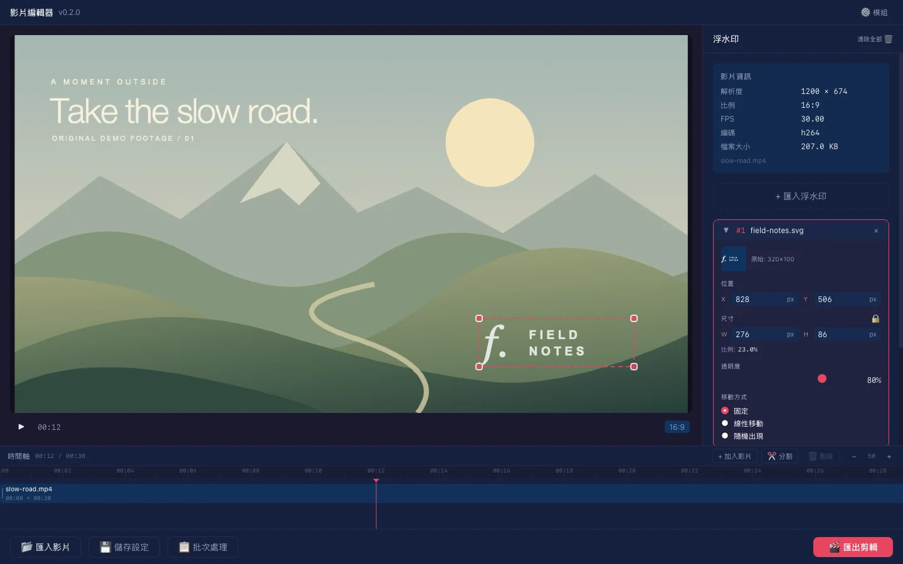

# 影片浮水印工具 (Video Watermark Tool)

<p align="center">
  
</p>

> 跨平台桌面應用程式，用於在影片上疊加圖片浮水印。支援拖放定位、大小調整、透明度、動態移動效果及批次處理。

[](https://github.com/TakumaLee/watermark-tool/actions/workflows/release.yml)
[產品官網](https://watermark-tool-ivory.vercel.app/) · [下載 Windows 安裝包](https://github.com/TakumaLee/watermark-tool/releases/tag/v0.2.0) · 原始碼公開

開發版在切換片段與拖曳時間軸時仍可能停頓。

---

## ✨ 功能特色

- 🎬 **影片匯入** — 支援 MP4、MOV、AVI、MKV 等常見格式，拖放或選擇檔案
- 🖼️ **浮水印疊加** — 支援 PNG、JPG、SVG、GIF、WebP 圖片
- 🖱️ **拖放定位** — 直接在預覽畫面上拖動浮水印到任意位置
- 📐 **縮放調整** — 四角拖動調整大小，支援鎖定/自由比例
- 🔲 **透明度控制** — 滑桿即時調整浮水印透明度
- ↔️ **動態移動** — 三種模式：固定、線性移動（水平/垂直/對角線，bounce 效果）、隨機出現
- 📦 **批次處理** — 一次對多個影片套用相同浮水印設定
- 💾 **設定檔** — 儲存/載入浮水印配置，快速重複使用
- 🎨 **深色主題** — 專為影片編輯設計的深色 UI

## 📥 下載與安裝

前往 [v0.2.0 下載頁](https://github.com/TakumaLee/watermark-tool/releases/tag/v0.2.0)，選擇一種 Windows x64 安裝格式即可：

- **EXE**：一般使用者建議選用，可選繁體中文安裝介面。
- **MSI**：適合需要 Windows Installer 格式的環境。

安裝包已內含 FFmpeg／ffprobe 9.0.1，不需要另外安裝。目標平台為 Windows 10／11 的 64 位元 x64 電腦；若缺少 Microsoft Edge WebView2，安裝時需要連線下載執行環境。這是未經程式碼簽章的初次公開版本，Windows 可能顯示發行者未驗證提示。詳細驗證範圍、檔案校驗碼與已知限制請見版本說明。

macOS／Linux 尚未提供已驗證的安裝包。上方為開發版實際介面截圖，使用原創示範素材。進階 AI 功能另需 Python、Whisper 或 IOPaint 等外部依賴，這些依賴未包含在本次安裝包。

## 🚀 使用方式

### 基本流程

1. **匯入影片** — 拖放影片到主畫面，或點擊「匯入影片」選擇檔案
2. **新增浮水印** — 在右側面板點擊「選擇圖片」匯入浮水印圖片
3. **調整位置** — 在預覽畫面上拖動浮水印到想要的位置
4. **調整屬性** — 透過右側面板調整大小、透明度、移動效果
5. **輸出** — 點擊底部「開始輸出」，選擇格式和品質

### 鍵盤快捷鍵

| 快捷鍵 | 功能 |
|--------|------|
| `Space` | 播放 / 暫停 |
| `Delete` / `Backspace` | 刪除選中浮水印 |
| `Escape` | 取消選取 |
| `Arrow Keys` | 微調浮水印位置（~1px） |
| `Shift + Arrow Keys` | 大幅調整位置（~10px） |

### 移動效果

| 模式 | 說明 |
|------|------|
| **固定** | 浮水印固定在指定位置 |
| **線性移動** | 沿水平/垂直/對角線方向來回移動，可調速度 |
| **隨機出現** | 定期在不同位置出現，可調頻率和淡入淡出 |

### 批次處理

1. 先設定好浮水印配置
2. 點擊「批次處理」按鈕
3. 選擇多個影片檔案
4. 設定輸出命名規則和品質
5. 開始處理，進度條顯示每個檔案狀態

### 設定檔

- **儲存設定** — 將當前浮水印配置儲存為 `.json` 檔案
- **快速儲存** — 儲存到應用資料目錄，方便下次載入
- **載入設定** — 從檔案或已儲存列表載入配置

## 🛠️ 開發指南

### 環境需求

- **Node.js** 20+
- **Rust** 1.77+
- **FFmpeg／ffprobe**（自行執行開發版時需準備；Windows 安裝包已內含 9.0.1）
- **系統依賴**（Linux）：
  ```bash
  sudo apt install libwebkit2gtk-4.1-dev libappindicator3-dev librsvg2-dev patchelf libgtk-3-dev
  ```

### 開發環境的 FFmpeg

Windows 安裝包不需要執行此步驟。自行開發時，可透過下列方式安裝 FFmpeg；正式 Windows 打包流程會下載並驗證指定版本的 sidecar，第三方來源紀錄見 [FFmpeg-SOURCES.md](docs/FFmpeg-SOURCES.md)。

```bash
# macOS (Homebrew)
brew install ffmpeg

# Windows (Chocolatey，或使用 scoop install ffmpeg)
choco install ffmpeg

# Ubuntu / Debian
sudo apt install ffmpeg

# Arch Linux
sudo pacman -S ffmpeg
```

### 快速開始

```bash
# Clone
git clone https://github.com/TakumaLee/watermark-tool.git
cd watermark-tool

# 安裝前端依賴
npm install

# 啟動開發環境（前端 + Tauri）
npm run tauri dev

# 前端獨立開發（僅 Vite dev server）
npm run dev
```

### 專案結構

```
watermark-tool/
├── .github/workflows/     # CI/CD 設定
├── docs/                  # 技術文件
├── src/                   # React 前端
│   ├── components/        # UI 組件
│   ├── hooks/             # 自訂 hooks
│   ├── stores/            # Zustand 狀態管理
│   ├── types/             # TypeScript 型別
│   ├── utils/             # 工具函式
│   └── test/              # 測試設定
├── src-tauri/             # Rust 後端
│   ├── src/
│   │   ├── commands/      # Tauri commands
│   │   └── ffmpeg/        # FFmpeg 命令組裝
│   └── icons/             # 應用圖示
├── vitest.config.ts       # 前端測試設定
├── CLAUDE.md              # 開發規範
├── SPEC.md                # 產品規格
└── PROGRESS.md            # 開發進度
```

### 常用指令

```bash
# 開發
npm run tauri dev          # 啟動完整開發環境
npm run dev                # 僅前端 dev server

# 建構
npm run tauri build        # 建構生產版本

# 測試
npm run test               # 前端單元測試（Vitest）
npm run test:watch         # 前端測試（watch 模式）
npm run test:coverage      # 前端測試覆蓋率報告
cd src-tauri && cargo test # Rust 後端測試

# 程式碼品質
npm run lint               # ESLint 檢查
cargo fmt                  # Rust 格式化
cargo clippy               # Rust lint
```

### 技術棧

| 層級 | 技術 |
|------|------|
| 框架 | [Tauri 2.0](https://v2.tauri.app/) |
| 前端 | React 19 + TypeScript 5 |
| 建構 | Vite 7 |
| 樣式 | Tailwind CSS 4 |
| 狀態 | Zustand |
| 後端 | Rust |
| 影片處理 | FFmpeg CLI |
| 測試 | Vitest + React Testing Library (前端) / cargo test (Rust) |
| CI/CD | GitHub Actions + tauri-action |

### Git 分支

- `master` — 預設分支
- `dev` — 開發分支
- `feat/*`、`fix/*`、`chore/*` — 工作分支

### Commit 格式

```
type(scope): description

# Examples:
feat(overlay): add diagonal movement support
fix(batch): handle FFmpeg timeout error
docs(readme): update installation guide
test(store): add watermarkStore unit tests
```

## 📄 授權

本次先公開原始碼。Repository 目前沒有 `LICENSE` 檔，授權條款仍待作者確認；舊版 README 的 MIT 標示尚未對應正式授權文件，因此不再沿用該標示。

公開 repo 與選定開源授權是分開的步驟；正式授權確定後會補上 `LICENSE`。

## 🙏 致謝

- [Tauri](https://tauri.app/) — 跨平台桌面框架
- [FFmpeg](https://ffmpeg.org/) — 影片處理引擎
- [React](https://react.dev/) — UI 框架
- [Tailwind CSS](https://tailwindcss.com/) — CSS 工具
